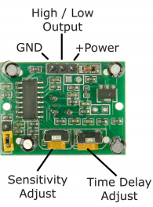
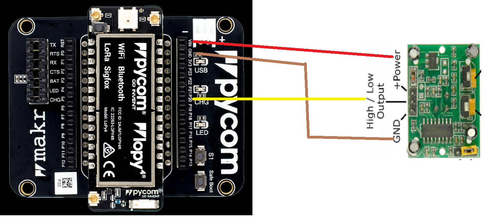
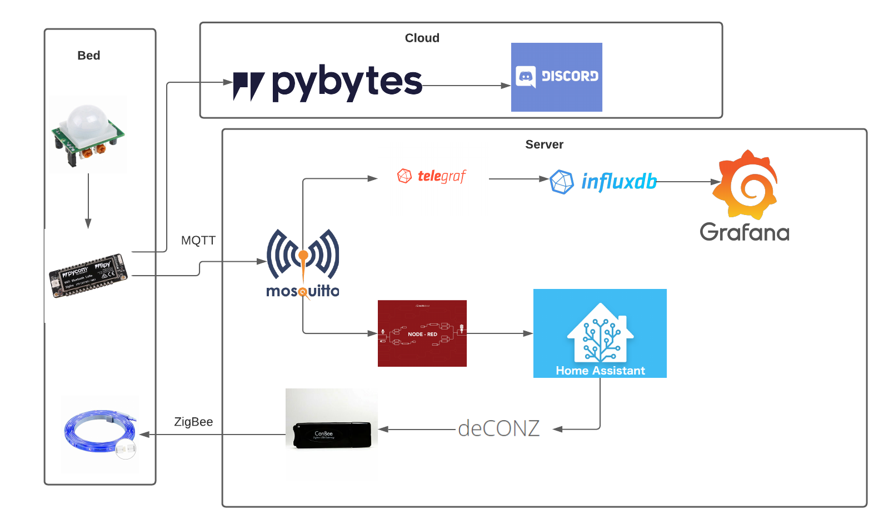
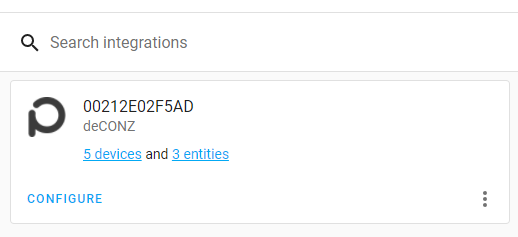
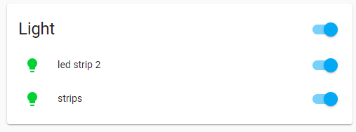
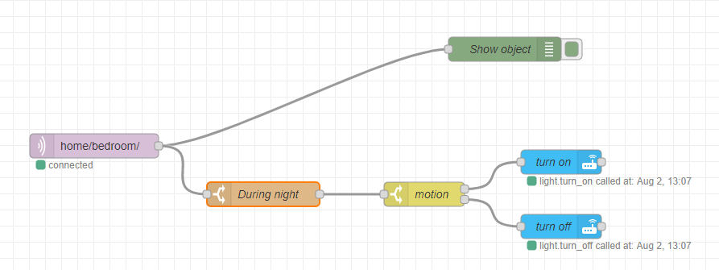
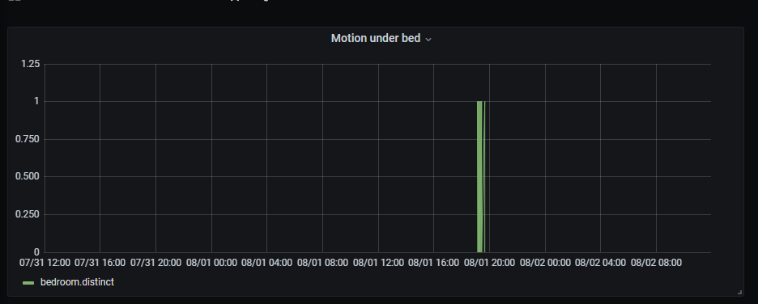
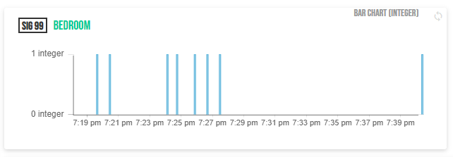

How to automatically turn on lights when waking up at night
--------------------------------------------------------------------
By Andreas Arnesson, aa226am.
Based on [lnu tuturial](https://hackmd.io/@lnu-iot/iot-tutorial#Project-report---IoT-tutorial-template).

This project started out as a way to detect when i go to bed and if i wake up in the middle of the night and leave the bed. I wanted to achieve this by turning my bed into a giant weight scale using [load cells and an HX711](https://learn.sparkfun.com/tutorials/load-cell-amplifier-hx711-breakout-hookup-guide). However a ran into problems with my solder and couldn't finish the build. This tutorial will instead show how we can use a RIP motion sensor under the bed to detect if i wake up in the middle of the night and leave the bed. With this data i want to turn on a light so i can see where i walk in the dark. I estimate i takes maximum 10h to reproduce this, depending on how much trouble you run into with docker.


## Objective

I often wake up in the middle of the night and need to go pee but i can't turn on the lights in the room to see where i walk because then i will wake my wife. So i want a way to automatically turn on a low light under the bed, that won't bother the wife, when i go to the bathroom. I also want to build the foundation for future automation of my home so i will send data about when i wake up to a local TIG-stack and have a trigger in Node-red to turn on and off the light using Deconz and Home-Assistant. And to learn how to send messages to discord i will also send a notification to a discord channel from Pybytes when movement is detected.


## Material

|  Material             | What |  Link  | Price |
|-----------------------|--------|-------|
| LoPy4                 | Computer to handle sensor | [:link:](https://pycom.io/product/lopy4/) | 380 kr |
| Expansion Board 3.1   | Expansion board to Lopy4 so we can connect the sensor easily | [:link:](https://pycom.io/product/expansion-board-3-0/) | 170 kr |
| Jumpwire              | Wire between lopy4 and sensor | [:link:](https://www.kjell.com/se/produkter/el-verktyg/elektronik/elektroniklabb/delbar-kopplingskabel-40-pol-15-cm-hona-hona-p87075) | 80 kr |
| RIP Motion sensors    | Motion sensor | [:link:](https://www.kjell.com/se/produkter/el-verktyg/arduino/arduino-tillbehor/rorelsedetektor-for-arduino-p87060) | 100 kr |
| Server / Raspberry Pi to run TIG | Server to host Docker |  | - / 690 kr |
| Philips hue led strip | Zigbee based led strip | [:link:](https://www.philips-hue.com/sv-se/p/hue-white-and-color-ambiance-lightstrip-plus-sockel-v4--2-meter/8718699703424)] | 900 kr |
| ConBee | Zigbee gateway that can be connected to the server. Use this to send commands to the led strip | [:link:](https://www.kjell.com/se/produkter/smarta-hem/controllers/conbee-ii-zigbee-controller-for-usb-p51419) | 549 kr|

Total price, with raspberry pi, 2869 kr. There are cheaper led strips available online, but i already had mine at home.


## Computer setup

I used Atom as IDE because i didn't get the Pymakr plugin to work in VSCode. Pymakr is used to send files to Lopy4 from the IDE. Before you can install Pymakr you need to install NodeJs. Before starting on the project you might need to update the firmware on the Lopy4 and expansion board. I didn't need to do that because mine was up-to-date when i bought it.

I use Docker on a server with Debian as OS to host the TIG stack, Mosquitto, node-red, Home-assistant and Deconz, here you can also use a Raspberry PI as a cheap alternative.


## Putting everything together

We only use one sensor and it is very easy to setup, both the code and the wiring. You can read [the manual](https://www.kjell.com/globalassets/mediaassets/744996_87060_manual_en.pdf) find more about how the sensor work and change sensitivity and delay.



The sensor needs 5 V of power to operate, therefor we need to connect `+Power` to the `VIN` slot on the expansion board. Connect `GND` to `GND` and `Output` to `P16`. Since it requires 5 V we don't need a resistor. I'm not using a breadboard as we only have one sensor and we don't need a resistor.




## Platform



This project is going to be a part of a larger home automation system and I don't want to have that data in the cloud. Therefore are my choices based on if i can host it locally or not. Although i will also use Pybytes and Discord but that is only to learn how to use them.


### Data visualization

I chose to use the TIG-stack ([Telegraf](https://www.influxdata.com/time-series-platform/telegraf/), [InfluxDB](https://www.influxdata.com/) and [Grafana](https://grafana.com/)) and [Mosquitto](https://github.com/eclipse/mosquitto) as a local MQTT broker. It has everything that is needed and it is easy to connect them. I also looked into replacing Telegraf and InfluxDB with Prometheus, but Prometheus require "code" to transform the data while with TI it is plug-n-play.

We send MQTT data to Mosquitto which telegraf listens for. Then telegraf adds the data to our database, InfluxDB. Grafana will then use the data to create a nice graph of when motion has been detected.

We also send a signal to Pybytes which we have integrated with Discord. So we get a message on Discord when motion is detected and when the motion has stopped.


### Control light

We also need a way to control the light under the bed, for that we use the following tools:

|   Tool    |  Purpose   |  Docker link |
|-----------|------------|--------------|
| Deconz | We connect the light to this, using the Zigbee protocol (ConBee) | [:link:](https://github.com/marthoc/docker-deconz) |
| Home-Assistant | Connected to Deconz and used to send commands to Deconz | [:link:](https://github.com/node-red/node-red-docker) |
| Node-Red  | Listen for MQTT message and relays it to Home-Assistant | [:link:](https://github.com/home-assistant/docker) |

Home-Assistant and Node-Red can be replaced with [Zigbee2MQTT ](https://www.zigbee2mqtt.io/), but i want expand my smart home and then we can set up further automation and events to control things in Home-Assistant and Node-red.


### Setup the platforms

I have used Docker for all the tools so setup is very easy. Copy `docker-compose.yml` and "telegraf.conf" and run `docker-compose up -d` and you are good to go.

Go to the ports in your browser for Deconz, Home-assistant, Grafana and Node-red to set them up, ex `localhost:8123` for home-assitant. Just follow the instructions.

Then connect Home-Assistant to Deconz by going to Configuration --> Integrations and search for Deconz, click that and follow the instructions.



Now you should be able to control the light from Home-Assistant and Deconz. Assuming you connected the light when setting up Deconz.



Now go to Node-Red and connect it to Home-Assistant. Go to "Manage Pallets" and search for Home-Assistant, choose the one with "Webhook" in the name. Drag a any of the Home-assistant buttons into the "flow", double click it and set up a new server. To find access token for Home-Assistant, got to profile and Long-live tokens, create a new one and copy it. Now go to "manage pallete" again and install "chronos", drag in any node from it and setup new location. Now you should be able to set up a flow to take MQTT input and if it is dark outside call a service in Home-Assistant. When the MQTT message contain a 1 motion has been detected and it is dark outside we want to turn on the light. When the message is a 0, we want to turn of the light. If it is light outside we do nothing.



Next, go to Grafana, add your InfluxDb instance as datasource and create a new dashboard.



Now for the notification, go to https://pybytes.pycom.io/ setup your account and connect it to your lopy4. Go so signals and create a new one, with numbers as message. Then go to "Integrations" and create one for Discord. Connect it to your signal and your Discord account, just follow the instructions.



In discord we will get a 1 when motion is detected and then a 0 when the motion has stopped.


The next step is to write the lopy4 code to send MQTT messages.


## The code

The code i quite simple, every 2 seconds check if motion has gone from no motion to motion or other way around. If so, send an MQTT request with motion status. At first i wanted to put the machine to sleep during the day and only have it active during the dat. But it turns out that Lopy 4 does not have a good way to handle time zones. We need to manually adjust for them in the code, this becomes extra annoying in Sweden because we change time between winter and summer. Therefore it was easier to move that logic to Node-red.

Read comments in the code for explanation of the code.

```python
import time
import ubinascii
import hashlib
from mqttclient import MQTTClient
from machine import Pin
from _pybytes import Pybytes, unique_id
from _pybytes_config import PybytesConfig

print("Setup")

# Use pybytes config to connect to Wifi
conf = PybytesConfig().read_config()
pybytes = Pybytes(conf)
pybytes.start()

# Prepare pin to read from sensor
pin_input = Pin('P16', mode = Pin.IN)

# mqtt settings
topic_pub = 'home/bedroom/'
broker_url = '<IP-to-broker>'

client_name = ubinascii.hexlify(hashlib.md5(unique_id()).digest()) # create a md5 hash of the pycom WLAN mac
c = MQTTClient(client_name,broker_url)
c.connect()

def send_value(motion, mq):
    # create message and send it
    value = '{"bedroom": { "motion": ' + str(motion) + '}}'
    try:
        mq.publish(topic_pub, value)
        print('Sensor data sent with value {}'.format(motion))
    except (NameError, ValueError, TypeError) as e:
        print('Failed to send!')
        print(e)

    # also send pybytes signal
    pybytes.send_signal(99, motion)


old_motion = 0
while True: # main loop
    motion = pin_input.value() # 1 for movement, 0 for nothing
    if old_motion != motion: #  if state has changed, send it
        old_motion = motion
        send_value(motion, c)
    time.sleep(2)
```


## Transmitting the data / connectivity

The project is setup in my apartment and has access to Wifi and is connected to a electricity outlet in the wall. And the data is sent to a server on the same network. Therefore we aren't restricted by long range or power consumption. With this knowledge, Wifi is a good choice for connectivity as we get fast speed and can send how much data we want. Even tough we only send very little data.

Data is sent as JSON data via the MQTT protocol.

We only send data when motion changes, if we go from no motion to motion or if we go from motion to no motion. And this is only done during the night. While motion is detected data is sent every 2 seconds.

Then the Zigbee protocol is used to control the light under the bed.


## Presenting the data

I have two way to display data, Grafana and in Pybytes.

In Grafana we have a simple dashboard that show all values and the timestamp the were created.


In Pybytes we have the same kind of dashboard.


### Triggers

Then there are two triggers.

There is the discord integration in Pybytes that sends every signal to discord.


Then there is the trigger to turn on and off the light in Node-red. If it is dark outside.


## Finalizing the design


There we have the final project!
